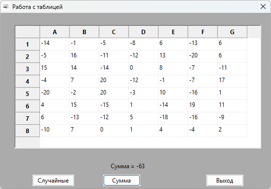

# DialogBlocks_wxGrid_demo
Пример работы с табличными данными в программе на C++ с использованием wxWidgets и DialogBlocks

## Ссылки:

http://www.anthemion.co.uk/dialogblocks/

***Бесплатная лицензия на DialogBlocks:*** https://github.com/proffix4/dialogblocks_free

https://www.wxwidgets.org/

http://www.anthemion.co.uk/dialogblocks/ImageBlocks-1.07-Setup.exe
